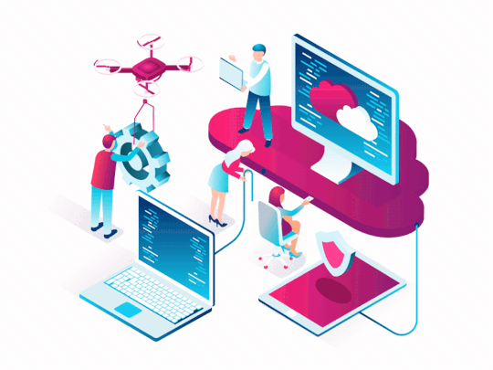

# ¡Hola! Este es mi primer Repositorio de GitHub .

Mi avance:

# 💻 En este apartado se irán agregando los Coneptos principales de Computo en la nube y la certificación AZ-900 Microsoft Fundamentals.

### Los sigientes conceptos se tomaron de los contenidos del curso de certificación AZ-9000 y fueron complementados con algunas aportaciones.

### Conceptos Clave:

  - [**Indice**](#)
  - [Parte 1](#parte-1)
    - [Alta disponibilidad](#alta-disponibilidad)
    - [Escalabilidad vertical](#escalabilidad-vertical)
    - [Escalabilidad horizontal](#escalabilidad-horizontal)
    - [Elasticidad](#elasticidad)
    - [Agilidad](#agilidad)
    - [Tolerancia a Fallo](#tolerancia-a-fallo)
    - [CapEx](#capex)
    - [OpEx](#opex)
    - [Nube Pública](#nube-pública)
    - [Nube Privada](#nube-privada)
    - [Nube Híbrida](#nube-híbrida)
    - [IaaS](#iaas)
    - [PaaS](#paas)
    - [SaaS](#saas)
    - [Regiones](#regiones)
    - [Geografías](#geografías)
    - [Zonas de Disponibilidad](#zonas-de-disponibilidad)
    - [Recursos](#recursos)
    - [Grupos de Recursos](#grupos-de-recursos)
    - [Gobernanza](#gobernanza)
    - [Nivel de Servicio (SLA)](#nivel-de-serviciosla)
    - [Azure](#azure)
    - [Cómputo en la nube](#cómputo-en-la-nube)
  - [**Parte 2**](#parte-2)
  - [**Categorias de Azure**](#categorias-de-azure)
    - [Compute](#compute)
    - [Network](#network)
    - [Storage](#storage)
    - [Database (DB)](#database-db)
    - [Internet of Things (IoT)](#internet-of-things-iot)
    - [Big Data](#big-data)
    - [Inteligencia Artificial (IA)](#inteligencia-artificial-ia)
    - [DevOps](#devops)
  - [Parte 3](#parte-3)
  - [Parte 4](#parte-4)
  - [Parte 5](#parte-5)
  - [Parte 6](#parte-6)

## Parte 1
### Descripción de los conceptos básicos de Azure

### Alta disponibilidad
Dependiendo del SLA, las aplicaciones de nube pueden proporcionar servicio continuo sin inactividad aparente incluso cuando las cosas van mal.

### Escalabilidad vertical
Incremento de la capacidad de cómputo (CPU) o de la RAM a los recursos ya existentes.

### Escalabilidad horizontal
Incremento de la capacidad de cómputo agregando más instancias del mismo recurso.

### Elasticidad
Los recursos se pueden autoescalar dependiendo de la necesidad actual. Siempre tienes los recursos que necesitas.

### Agilidad
Implementación y configuración rápida de recursos de nube a medida que los requerimientos cambian.

### Tolerancia a Fallo
Tomar ventaja de los servicios de respaldo, replicación de datos y geo-distribución de la nube. Tus datos están seguros en caso de desastre.

### CapEx
Gasto inicial de dinero en infraestructura física se deduce a lo largo del tiempo.

### OpEx
Gasto de dinero en servicios o productos en el momento y se factura por ellos al momento. No hay inversión inicial.

### Nube Pública
Los servicios se ofrecen a través de la red Internet pública y están disponibles para cualquiera que quiera comprarlos, es decir, conseguir servicios de nube de terceros como Microsoft Azure.

### Nube Privada
Los recursos informáticos son de uso exclusivo de los usuarios de una empresa u organización la cual se encarga de el consumo de electricidad, seguridad, mantenimiento

### Nube Híbrida
Entorno que combina una nube pública y una nube privada, lo que permite compartir datos y aplicaciones entre ellas.

### IaaS
**Infraestructure as a Service (Infraestructura como servicio)**
Modelo de servicio que es muy cercano a tener data centers fisicos. El proveedor solo se encarga del hardware.

### PaaS
**Platform as a Service (Plataforma como servicio)**
Modelo de servicio en un entorno de alujamiento gestionado. El proveedor se encarga de las maquinas virtuales y recursos de red. El inquilino de las aplicaciones.

### SaaS
**Software as a Service (Software como servicio)**
El proveedor de nube brinda las aplicaciones y se encarga de ellas. El inquilino solo provee y se encarga de los datos.

### Regiones
Área geográfica del planeta que tiene por lo menos un centro de datos de Azure.

### Geografías
Zona que contiene dos o más regiones de Azure.

### Zonas de Disponibilidad
Centros de datos separados físicamente dentro de una región de Azure con electricidad, refrigeración y equipo independientes.

### Recursos
Elemento administrable que está disponible mediante Azure.

### Grupos de Recursos
Contenedor lógico que incluye los recursos relacionados a una solución.

### Gobernanza
Establecer reglas y directivas sobre los recursos de la organización y garantizar que se apliquen.

### Nivel de Servicio (SLA)
Porcentaje de disponibilidad y rendimeinto de los recursos durante un tiempo determinado.

### Azure
Servicio de nube de Microsoft que entrega servicios informáticos a través de Internet.

### Cómputo en la nube
Es la entrega de servicios de computo a través de Internet.

## Parte 2
### Descripción de los servicios básicos de Azure

## Categorias de Azure
Los servicios de Azure se agrupan en diferentes categorias las cuales son:

### Compute
Proporciona servicios de cómputo o procesamiento bajo demanda. Por ejemplo:
- Maquinas virtuales (VM)
- Kubernetes
- Azure Virtual Machine Scale Sets
- Azure Functions
- Azure Container Instances

### Network
Proporciona servicios de red que permiten conectar los recursos con el mundo exterior. Por ejemplo:
- Azure Virtual Network
- Azure Traffic Manager
- Azure DDoS Protection
- Balanceadores de carga

### Storage
Proporciona servicios de almacenamiento de archivos y objetos. Por ejemplo:
- Azure Blob Storage
- Azure File Storage
- Azure Queue Storage
- Azure Table Storage

### Database (DB)
Proporciona servicios de bases de datos para una amplia variedad de tipos y volumenes de datos. Por ejemplo:
- Cosmos DB
- Azure SQL Database
- Azure Database Migration Service

### Internet of Things (IoT)
Proporciona servicios de IoT para conectar y recibir información de sensores, relojes inteligentes, maquinaria, etc. Por ejemplo:
- IoT Central
- Azure IoT hub
- IoT Edge

### Big Data
Porporciona servicios para el procesamiento y análisis de grandes cantidades de registros. Por ejemplo:
- Azure Synapse Analytics
- Azure Databricks
- Azure HDInsight

### Inteligencia Artificial (IA)
Proporciona servicios de aprendizaje automático (prefabricados o no). Por ejemplo:
- Azure Machine Learning Service
- Azure Machine Learning Studio
- Azure Cognitive Services

### DevOps
Ayuda a los equipos de desarrollo de software a automatizar y hacer eficientes sus procesos. Por ejemplo:
- Azure DevOps
- Azure DevTest Labs

## Parte 3
### Descripción de las principales soluciones y herramientas de administración de Azure

## Parte 4
### Descripción de las características de seguridad general y de seguridad de red

## Parte 5
### Descripción de las características de identidad, gobernanza, privacidad y cumplimiento

## Parte 6
### Descripción de los acuerdos de nivel de servicio y la administración de costos de Azure
