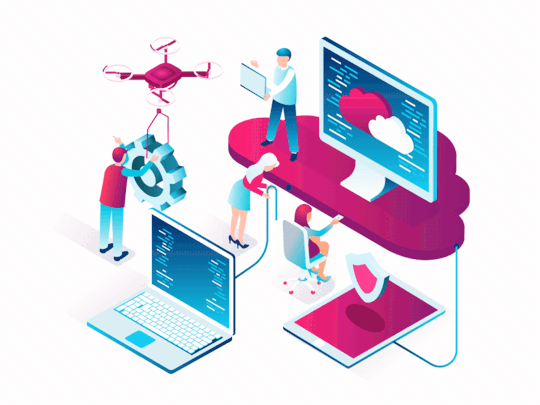

# ¡Hola! Este es mi primer Repositorio de GitHub .

Mi avance:

# 💻 En este apartado se irán agregando los Coneptos principales de Computo en la nube y la certificación AZ-900 Microsoft Fundamentals.

### Los sigientes conceptos se tomaron de los contenidos del curso de certificación AZ-9000 y fueron complementados con algunas aportaciones.

### Conceptos Clave:

  - [**Indice**](#)
  - [Parte 1](#parte-1) 
  - [Link de Modulo 1](res/P1_Modulo1.md)
    - [Alta disponibilidad](#alta-disponibilidad)
    - [Escalabilidad vertical](#escalabilidad-vertical)
    - [Escalabilidad horizontal](#escalabilidad-horizontal)
    - [Elasticidad](#elasticidad)
    - [Agilidad](#agilidad)
    - [Tolerancia a Fallo](#tolerancia-a-fallo)
    - [CapEx](#capex)
    - [OpEx](#opex)
    - [Nube Pública](#nube-pública)
    - [Nube Privada](#nube-privada)
    - [Nube Híbrida](#nube-híbrida)
    - [IaaS](#iaas)
    - [PaaS](#paas)
    - [SaaS](#saas)
    - [Regiones](#regiones)
    - [Geografías](#geografías)
    - [Zonas de Disponibilidad](#zonas-de-disponibilidad)
    - [Recursos](#recursos)
    - [Grupos de Recursos](#grupos-de-recursos)
    - [Gobernanza](#gobernanza)
    - [Nivel de Servicio (SLA)](#nivel-de-serviciosla)
    - [Azure](#azure)
    - [Cómputo en la nube](#cómputo-en-la-nube)
  - [**Parte 2**](#parte-2)
  - [**Categorias de Azure**](#categorias-de-azure)
    - [Compute](#compute)
    - [Network](#network)
    - [Storage](#storage)
    - [Database (DB)](#database-db)
    - [Internet of Things (IoT)](#internet-of-things-iot)
    - [Big Data](#big-data)
    - [Inteligencia Artificial (IA)](#inteligencia-artificial-ia)
    - [DevOps](#devops)
  - [Parte 3](#parte-3)
  - [Parte 4](#parte-4)
  - [Parte 5](#parte-5)
  - [Parte 6](#parte-6)

## Parte 1

### Descripción de los conceptos básicos de Azure
**[Link de Modulo 1](res/P1_Modulo1.md)**

### Alta disponibilidad
Dependiendo del SLA, las aplicaciones de nube pueden proporcionar servicio continuo sin inactividad aparente incluso cuando las cosas van mal.

### Escalabilidad vertical
Incremento de la capacidad de cómputo (CPU) o de la RAM a los recursos ya existentes.

### Escalabilidad horizontal
Incremento de la capacidad de cómputo agregando más instancias del mismo recurso.

### Elasticidad
Los recursos se pueden autoescalar dependiendo de la necesidad actual. Siempre tienes los recursos que necesitas.

### Agilidad
Implementación y configuración rápida de recursos de nube a medida que los requerimientos cambian.

### Tolerancia a Fallo
Tomar ventaja de los servicios de respaldo, replicación de datos y geo-distribución de la nube. Tus datos están seguros en caso de desastre.

### CapEx
Gasto inicial de dinero en infraestructura física se deduce a lo largo del tiempo.

### OpEx
Gasto de dinero en servicios o productos en el momento y se factura por ellos al momento. No hay inversión inicial.

### Nube Pública 
**[Link de Modulo 2 - ](https://github.com/UlisesCortes/WikiAzure/blob/main/res/P1_Modulo2.md#nube-publica)**
Los servicios se ofrecen a través de la red Internet pública y están disponibles para cualquiera que quiera comprarlos, es decir, conseguir servicios de nube de terceros como Microsoft Azure.

### Nube Privada
Los recursos informáticos son de uso exclusivo de los usuarios de una empresa u organización la cual se encarga de el consumo de electricidad, seguridad, mantenimiento

### Nube Híbrida
Entorno que combina una nube pública y una nube privada, lo que permite compartir datos y aplicaciones entre ellas.

### IaaS
**Infraestructure as a Service (Infraestructura como servicio)**
Modelo de servicio que es muy cercano a tener data centers fisicos. El proveedor solo se encarga del hardware.

### PaaS
**Platform as a Service (Plataforma como servicio)**
Modelo de servicio en un entorno de alujamiento gestionado. El proveedor se encarga de las maquinas virtuales y recursos de red. El inquilino de las aplicaciones.

### SaaS
**Software as a Service (Software como servicio)**
El proveedor de nube brinda las aplicaciones y se encarga de ellas. El inquilino solo provee y se encarga de los datos.

### Regiones
Área geográfica del planeta que tiene por lo menos un centro de datos de Azure.

### Geografías
Zona que contiene dos o más regiones de Azure.

### Zonas de Disponibilidad
Centros de datos separados físicamente dentro de una región de Azure con electricidad, refrigeración y equipo independientes.

### Recursos
Elemento administrable que está disponible mediante Azure.

### Grupos de Recursos
Contenedor lógico que incluye los recursos relacionados a una solución.

### Gobernanza
Establecer reglas y directivas sobre los recursos de la organización y garantizar que se apliquen.

### Nivel de Servicio (SLA)
Porcentaje de disponibilidad y rendimeinto de los recursos durante un tiempo determinado.

### Azure

**[Link de Modulo 1](res/P1_Modulo1.md)**
Servicio de nube de Microsoft que entrega servicios informáticos a través de Internet.

### Cómputo en la nube
Es la entrega de servicios de computo a través de Internet.

## Parte 2
### Descripción de los servicios básicos de Azure

## Categorias de Azure
Los servicios de Azure se agrupan en diferentes categorias las cuales son:

### Compute
Proporciona servicios de cómputo o procesamiento bajo demanda. Por ejemplo:
- Maquinas virtuales (VM)
- Kubernetes
- Azure Virtual Machine Scale Sets
- Azure Functions
- Azure Container Instances

### Network
Proporciona servicios de red que permiten conectar los recursos con el mundo exterior. Por ejemplo:
- Azure Virtual Network:
     Las redes virtuales de Azure permiten a los recursos de Azure, como las máquinas virtuales, las aplicaciones web y las bases de datos, comunicarse entre sí, con los usuarios de Internet y con los equipos cliente en el entorno local. Se puede pensar en una red de Azure como en un conjunto de recursos que se vincula a otros recursos de Azure.
Las redes virtuales de Azure proporcionan las importantes funcionalidades de red siguientes:

- Aislamiento y segmentación
-	Comunicación con Internet
-	Comunicación entre recursos de Azure
-	Comunicación con los recursos locales
-	Enrutamiento del tráfico de red
-	Filtrado del tráfico de red
-	Conexión de redes virtuales

- Azure Traffic Manager
- Azure DDoS Protection
- Balanceadores de carga

### Storage
Proporciona servicios de almacenamiento de archivos y objetos. Por ejemplo:
- Azure Blob Storage
- Azure File Storage
- Azure Queue Storage
- Azure Table Storage

### Database (DB)
Proporciona servicios de bases de datos para una amplia variedad de tipos y volumenes de datos. Por ejemplo:
- Cosmos DB
  Es un servicio de base de datos de varios modelos distribuido globalmente. Puede escalar de forma elástica e independiente el rendimiento y el almacenamiento en cualquier número de regiones de Azure de todo el mundo. Puede aprovechar un acceso rápido y en milisegundos de un solo dígito a los datos mediante cualquiera de las diversas API populares. Azure Cosmos DB proporciona de forma exclusiva contratos de nivel de servicio completos para garantizar el rendimiento, la latencia, la disponibilidad y la coherencia.
  
- Azure SQL Database
Es un motor de base de datos de plataforma como servicio (PaaS). Controla la mayoría de las funciones de administración de bases de datos, como las actualizaciones, las aplicaciones de revisiones, las copias de seguridad y la supervisión, sin intervención del usuario. SQL Database proporciona disponibilidad del 99,99 %. Las capacidades de PaaS que están integradas en SQL Database permiten centrarse en las actividades de administración y optimización de bases de datos específicas del dominio que son críticas para el negocio. SQL Database es un servicio totalmente administrado que ofrece alta disponibilidad, copias de seguridad y otras operaciones de mantenimiento comunes. Microsoft controla todas las actualizaciones del código del sistema operativo y SQL. No hace falta administrar la infraestructura subyacente
 
- Azure Database Migration Service
puede generar informes de evaluación que proporcionan recomendaciones para ayudarlo a través de los cambios necesarios anteriores a la ejecución de una migración. Después de evaluar y resolver cualquier corrección necesaria, está listo para comenzar el proceso de migración. Azure Database Migration Service realiza todos los pasos necesarios. El usuario solo tiene que cambiar la cadena de conexión en las aplicaciones.
### Internet of Things (IoT)
Proporciona servicios de IoT para conectar y recibir información de sensores, relojes inteligentes, maquinaria, etc. Por ejemplo:

- Azure IoT hub
es un servicio administrado hospedado en la nube que actúa como centro de mensajes centralizado para la comunicación bidireccional entre la aplicación de IoT y los dispositivos que administra. Puede usar Azure IoT Hub para compilar soluciones de IoT con comunicaciones confiables y seguras entre millones de dispositivos de IoT y un back-end de soluciones hospedadas en la nube. Puede conectar prácticamente cualquier dispositivo al centro de IoT.
El servicio IoT Hub admite las comunicaciones desde el dispositivo a la nube y desde la nube al dispositivo. También admite varios patrones de mensajería, como telemetría de dispositivo a la nube, carga de archivos desde dispositivos y métodos de solicitud-respuesta para controlar los dispositivos desde la nube. Una vez que un centro de IoT recibe los mensajes de un dispositivo, puede enrutarlos a otros servicios de Azure.
Desde una perspectiva de nube a dispositivo, IoT Hub permite ordenar y controlar. Es decir, puede tener control remoto manual o automatizado de los dispositivos conectados, por lo que puede indicar al dispositivo que abra válvulas, establezca temperaturas objetivo, reinicie dispositivos atascados, etc.
La supervisión de IoT Hub le ayuda a conservar el estado de la solución, ya que realiza el seguimiento de eventos, como la creación, los errores y las conexiones de dispositivos.

- IoT Central
se basa en IoT Hub y agrega un panel que le permite conectar, supervisar y administrar sus dispositivos de IoT. La interfaz de usuario (UI) visual facilita la conexión rápida de nuevos dispositivos y la inspección a medida que comienzan a enviar mensajes de telemetría o de error. Puede ver el rendimiento general de todos los dispositivos en conjunto y configurar alertas que envían notificaciones cuando un dispositivo concreto necesita mantenimiento. Por último, puede enviar actualizaciones de firmware al dispositivo.
Para ayudarle a ponerse en marcha rápidamente, IoT Central proporciona plantillas de inicio para escenarios comunes en diferentes sectores, como la venta directa, la energía, la atención sanitaria y la administración pública. A continuación, puede personalizar las plantillas de inicio directamente en la interfaz de usuario eligiendo los temas existentes o creando su propio tema personalizado, estableciendo el logotipo, etc. IoT Central permite adaptar las plantillas de inicio a los datos específicos que se envían desde los dispositivos, los informes que se quieren ver y las alertas que se quieren enviar.

- IoT Edge
- Azure Sphere
crea una solución de IoT de un extremo a otro de alta seguridad para los clientes que lo abarca todo, desde el hardware y el sistema operativo del dispositivo hasta el método seguro para enviar mensajes desde el dispositivo al centro de mensajes. Azure Sphere tiene características de comunicación y seguridad integradas para dispositivos conectados a Internet.
Azure Sphere consta de tres partes:
- La primera parte es la unidad de microcontrolador (MCU) de Azure Sphere, que se encarga de procesar el sistema operativo y las señales de los sensores conectados. En la siguiente imagen se muestra la MCU del kit de desarrollo Seeed Azure Sphere MT3620, uno de los distintos kits de inicio disponibles para la creación de prototipos y el desarrollo de aplicaciones de Azure Sphere.
- La segunda parte es un sistema operativo (SO) Linux personalizado, que controla la comunicación con el servicio de seguridad y puede ejecutar el software del proveedor.
- La tercera parte es el servicio de seguridad de Azure Sphere, también conocido como AS3. Su trabajo es asegurarse de que el dispositivo no se ha puesto en peligro de forma malintencionada. Cuando el dispositivo intenta conectarse a Azure, primero debe autenticarse, por dispositivo, mediante autenticación basada en certificado. Si se autentica correctamente, AS3 comprueba que el dispositivo no se haya alterado. Una vez que ha establecido un canal de comunicación seguro, AS3 inserta en el dispositivo las actualizaciones de software del sistema operativo o desarrolladas por el cliente (y aprobadas).

### Big Data
Porporciona servicios para el procesamiento y análisis de grandes cantidades de registros. Por ejemplo:
- Azure Synapse Analytics
es un servicio de análisis ilimitado que reúne el almacenamiento de datos empresariales y el análisis de macrodatos. Puede consultar los datos como prefiera mediante recursos sin servidor o aprovisionados a escala. Tiene una experiencia unificada para ingerir, preparar, administrar y servir datos para las necesidades inmediatas de inteligencia empresarial y aprendizaje automático.

- Azure Databricks
  ayuda a descubrir información de todos los datos y a crear soluciones de inteligencia artificial. Puede configurar el entorno de Apache Spark en minutos y, después, escalar automáticamente y colaborar en proyectos compartidos en un área de trabajo interactiva. Azure Databricks admite Python, Scala, R, Java y SQL, así como marcos y bibliotecas de ciencia de datos, como TensorFlow, PyTorch y Scikit-learn.
  
- Azure HDInsight
es un servicio de análisis de código abierto totalmente administrado para empresas. Es un servicio en la nube que hace que sea más fácil, rápido y rentable procesar grandes cantidades de datos. Puede ejecutar marcos de código abierto populares y crear tipos de clúster, como Apache Spark, Apache Hadoop, Apache Kafka, Apache HBase, Apache Storm y Machine Learning Services. HDInsight también admite una amplia gama de escenarios, como la extracción, la transformación y la carga de datos (ETL), el almacenamiento de datos, el aprendizaje automático e IoT.

### Inteligencia Artificial (IA)
Proporciona servicios de aprendizaje automático (prefabricados o no). Por ejemplo:
- Azure Machine Learning Service
- Azure Machine Learning Studio
- Azure Cognitive Services

### DevOps
Ayuda a los equipos de desarrollo de software a automatizar y hacer eficientes sus procesos. Por ejemplo:
- Azure DevOps
- Azure DevTest Labs

## Parte 3
### Descripción de las principales soluciones y herramientas de administración de Azure

## Parte 4
### Descripción de las características de seguridad general y de seguridad de red

## Parte 5
### Descripción de las características de identidad, gobernanza, privacidad y cumplimiento

## Parte 6
### Descripción de los acuerdos de nivel de servicio y la administración de costos de Azure
